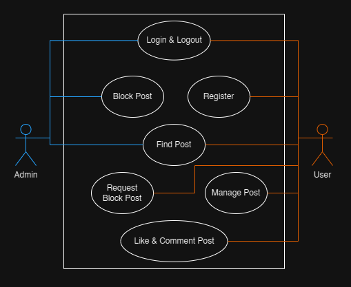

# Go Blog Backend
REST API app for blog post management using Go and PostgreSQL. This app, is purposed to make it easier for people to post blogs.

## Contents
- [How to install (using Go)](#how-to-install-using-go)
- [How to install (using Docker)](#how-to-install-using-docker)
- [Usecase diagram](#usecase-diagram)
- [ERD and database](#erd-and-database)
- [External library](#external-library)
- [API documentation](#api-documentation)
- [Login dummy](#login-dummy)
- [Logging](#logging)
- [Unit test](#unit-test)
- [Manual test](#manual-test)

---

## How to install (using Go)
```Requirement: Go Programming Language, Golang Migrate, & PostgreSQL```

1. Clone this repository
```sh
git clone https://github.com/hasyimzii/go_blog_backend.git
```
2. Open repository in terminal
```sh
cd go_blog_backend
```
3. Open PostgreSQL & make database
```sql
CREATE DATABASE go_blog_backend;
```
4. Run migrations
```sh
migrate -database postgres://<username>:<password>@localhost:5432/go_blog_backend?sslmode=disable -path app/migrations up
```
5. Build Go app
```go
go build
```
6. Excecute binary file
```sh
./go_blog_backend
```
7. Now the app is running

## How to install (using Docker)
```Requirement: Docker```

1. Clone this repository
```sh
git clone https://github.com/hasyimzii/go_blog_backend.git
```
2. Open repository in terminal
```sh
cd go_blog_backend
```
3. Excecute docker compose command
```sh
docker composer up -d
```
4. Now the code is running
5. (If you want to remove the container, image, & volumes) 
```sh
docker compose down
docker image rm go_blog_backend:1.0.0
docker volume rm go_blog_backend_logs
docker volume rm go_blog_backend_postgres
docker volume rm go_blog_backend_migrations
```

---

## Usecase diagram


In this app, there are 2 actors:
- Admin : User who has access to find and block posts
- User : User who has acces to manage, find, like, comment, and request block post

## ERD and database


- Database service: PostgreSQL
- Database migrations folder [./app/migrations/](./app/migrations/)

## External library
- [joho/godotenv](https://github.com/joho/godotenv)
- [gofiber/fiber](https://github.com/gofiber/fiber)
- TODO: external lib list

## API documentation
- API documentation folder [./docs/api/](./docs/api/)
- All API specification documented using Markdown

## Login dummy
```
// Admin
Email: admin@mail.com
Pass: admin123
```
```
// User
Email: user@mail.com
Pass: user123
```

## Logging
- Logging folder [./logs/](./logs/)
- The logging output stored in ```app.log``` file

## Unit test
```Requirement: Go Programming Language```

- Unit testing folder [./tests/](./tests/)
- Run this command in terminal
```go
go test -v ./tests
```